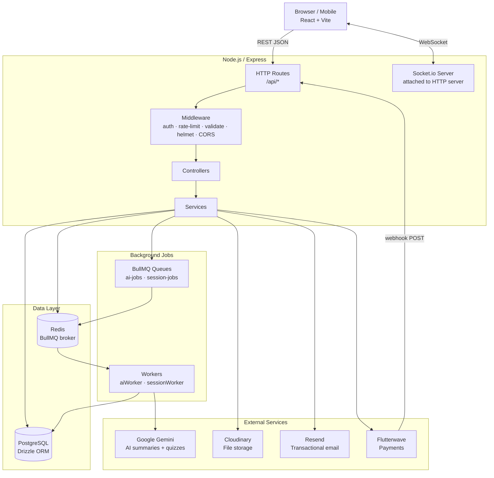
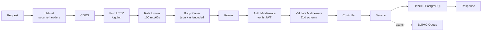
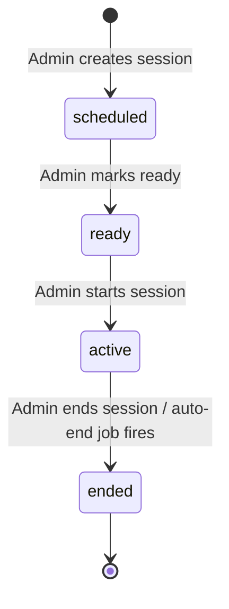
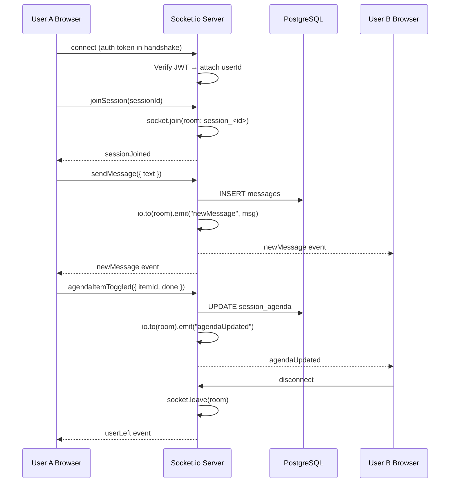
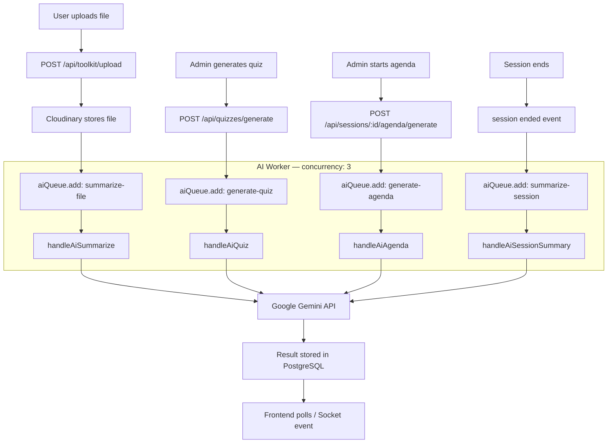
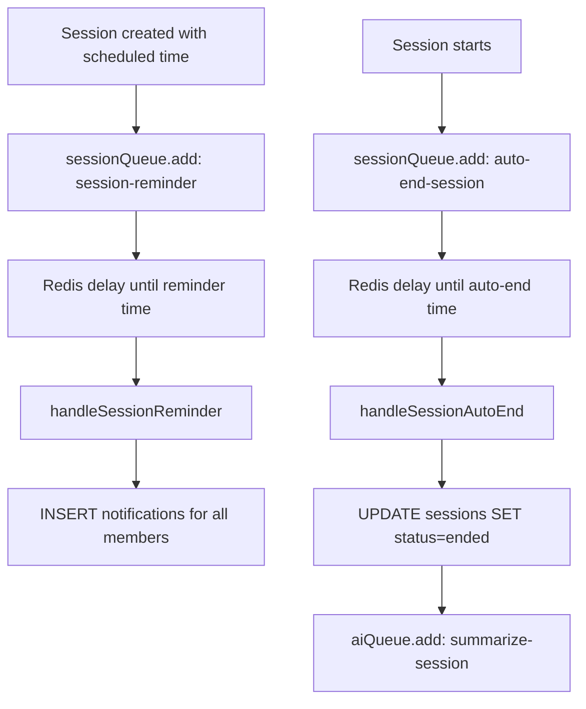
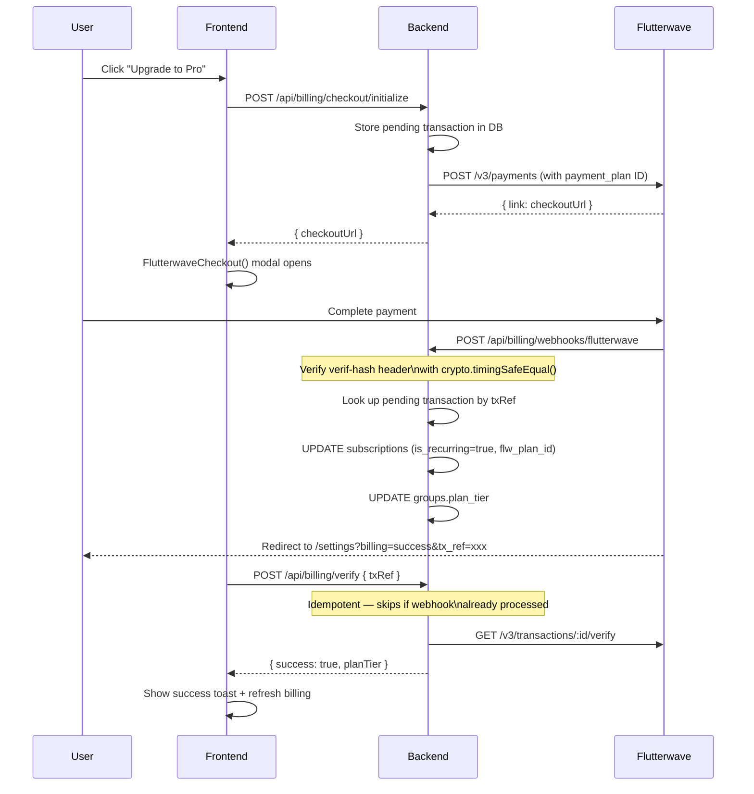

# Vyrdly — Backend

The API server, real-time engine, and background job processor for Vyrdly.

**Production:** [vyrdly-backend.onrender.com](https://vyrdly-backend.onrender.com)  
**Frontend:** [vyrdly.vercel.app](https://vyrdly.vercel.app)

---

## Tech Stack

| Layer | Technology |
|-------|-----------|
| Runtime | Node.js 26 |
| Framework | Express 5 |
| Language | TypeScript 5.4 |
| ORM | Drizzle ORM |
| Database | PostgreSQL 17 |
| Cache / Queue broker | Redis (ioredis) |
| Job queue | BullMQ |
| Real-time | Socket.io 4 |
| AI | Google Gemini (`@google/generative-ai`) |
| File storage | Cloudinary |
| Email | Resend |
| Payments | Flutterwave v3 |
| Logging | Pino + pino-http |
| Validation | Zod |
| Auth | JWT (jsonwebtoken) + bcryptjs |

---

## System Architecture



---

## Request Lifecycle



> The Flutterwave webhook route (`POST /api/billing/webhooks/flutterwave`) bypasses the rate limiter — it is mounted before `app.use(generalRateLimit)`.

---

## Database Schema

```mermaid
erDiagram
    users {
        uuid id PK
        varchar name
        varchar email UK
        varchar password
        boolean is_verified
        boolean onboarding_completed
        jsonb goals
        jsonb availability
    }

    groups {
        uuid id PK
        varchar name
        varchar subject
        text goal
        enum visibility
        enum plan_tier
        uuid admin_id FK
    }

    group_members {
        uuid id PK
        uuid group_id FK
        uuid user_id FK
        enum role
        enum status
    }

    group_invite_links {
        uuid id PK
        uuid group_id FK
        uuid created_by FK
        varchar token UK
        integer max_uses
        integer use_count
        timestamp expires_at
        boolean is_active
    }

    sessions {
        uuid id PK
        uuid group_id FK
        varchar title
        enum status
        text goal
        varchar scheduled_date
        varchar scheduled_time
        timestamp started_at
        timestamp ended_at
        text ai_summary
        uuid created_by FK
    }

    session_agenda {
        uuid id PK
        uuid session_id FK
        text topic
        boolean done
        integer order
    }

    session_participants {
        uuid id PK
        uuid session_id FK
        uuid user_id FK
        timestamp joined_at
        timestamp left_at
    }

    messages {
        uuid id PK
        uuid session_id FK
        uuid user_id FK
        text text
        boolean is_ai_chat
        boolean is_ai_response
    }

    files {
        uuid id PK
        uuid group_id FK
        uuid uploaded_by FK
        varchar name
        text url
        enum type
        boolean has_ai_summary
        text summary
    }

    quizzes {
        uuid id PK
        uuid session_id FK
        uuid group_id FK
    }

    quiz_questions {
        uuid id PK
        uuid quiz_id FK
        text question
        jsonb options
        text correct_answer
        integer order
    }

    quiz_answers {
        uuid id PK
        uuid quiz_id FK
        uuid question_id FK
        uuid user_id FK
        text answer
        boolean is_correct
    }

    notifications {
        uuid id PK
        uuid user_id FK
        enum type
        varchar title
        text body
        boolean read
    }

    transactions {
        uuid id PK
        uuid group_id FK
        uuid initiated_by FK
        varchar tx_ref UK
        enum status
        varchar plan_tier
        enum billing_cycle
        numeric amount
        varchar currency
    }

    subscriptions {
        uuid id PK
        uuid group_id FK UK
        varchar plan_tier
        enum billing_cycle
        enum status
        timestamp start_date
        timestamp end_date
        boolean is_recurring
        varchar flw_plan_id
        varchar flw_subscription_id
    }

    calendar_connections {
        uuid id PK
        uuid user_id FK
        enum provider
        text access_token
        text refresh_token
        timestamp token_expiry
        boolean is_active
    }

    calendar_events {
        uuid id PK
        uuid user_id FK
        uuid session_id FK
        uuid connection_id FK
        varchar provider_event_id
    }

    users ||--o{ group_members : "joins"
    groups ||--o{ group_members : "has"
    groups ||--o{ group_invite_links : "has"
    groups ||--o{ sessions : "schedules"
    groups ||--o{ files : "stores"
    sessions ||--o{ session_agenda : "has"
    sessions ||--o{ session_participants : "has"
    sessions ||--o{ messages : "has"
    sessions ||--o{ quizzes : "has"
    quizzes ||--o{ quiz_questions : "has"
    quiz_questions ||--o{ quiz_answers : "has"
    users ||--o{ notifications : "receives"
    groups ||--|| subscriptions : "has"
    groups ||--o{ transactions : "has"
    users ||--o{ calendar_connections : "has"
    users ||--o{ calendar_events : "has"
```

---

## Session Lifecycle



Auto-end: `session.autoend` BullMQ job fires after a configurable duration and transitions `active → ended`.

---

## Real-time Architecture (Socket.io)



Key socket events: `joinSession`, `leaveSession`, `sendMessage`, `newMessage`, `agendaItemToggled`, `agendaUpdated`, `userJoined`, `userLeft`, `quizStarted`, `quizAnswered`.

---

## AI Processing Pipeline



All AI jobs have **3 retry attempts** with exponential backoff (2s base). Failed jobs are kept for debugging (`removeOnFail: 50`).

---

## Session Jobs Pipeline



---

## Billing & Payment Flow



Recurring renewals: Flutterwave auto-charges on the plan interval and fires the webhook again. Each renewal creates a new transaction row and updates the subscription's `endDate` and `nextRenewalDate`.

---

## Entitlement Enforcement

Plan limits are enforced at the service layer before writes:

| Check | Free | Pro | Commercial |
|-------|------|-----|------------|
| Members per group | 10 | 20 | Unlimited |
| Quiz questions / session | 10 | 50 | 100 |
| Toolkit AI summaries / month | 10 | 100 | 500 |

Functions: `assertMemberCapForGroup`, `assertQuizQuestionLimitForGroup`, `assertToolkitSummaryQuotaForGroup` — all in `src/modules/billing/entitlements.ts`.

---

## API Routes Summary

### Auth — `/api/auth`
| Method | Path | Description |
|--------|------|-------------|
| POST | `/register` | Register new user |
| POST | `/login` | Login |
| POST | `/verify-otp` | Verify email OTP |
| POST | `/resend-otp` | Resend OTP |
| POST | `/forgot-password` | Request password reset |
| POST | `/reset-password` | Reset password with code |

### Users — `/api/users`
| Method | Path | Description |
|--------|------|-------------|
| GET | `/me` | Get current user |
| PATCH | `/me` | Update profile / onboarding |
| PATCH | `/me/password` | Change password |
| DELETE | `/me` | Delete account |

### Groups — `/api/groups`
| Method | Path | Description |
|--------|------|-------------|
| GET | `/` | List user's groups |
| POST | `/` | Create group |
| GET | `/:groupId` | Get group with members |
| PATCH | `/:groupId` | Update group |
| DELETE | `/:groupId` | Delete group |
| POST | `/:groupId/invite` | Invite by email |
| POST | `/:groupId/invites/accept` | Accept email invite |
| POST | `/:groupId/invites/decline` | Decline email invite |
| POST | `/:groupId/invite-links` | Create shareable invite link |
| GET | `/:groupId/invite-links` | List active invite links |
| DELETE | `/:groupId/invite-links/:linkId` | Revoke invite link |
| GET | `/join/:token/preview` | Preview invite link (public) |
| POST | `/join/:token/accept` | Accept invite link |
| DELETE | `/:groupId/members/:memberId` | Remove member |
| PATCH | `/:groupId/members/:memberId/role` | Change member role |
| POST | `/:groupId/leave` | Leave group |
| GET | `/:groupId/join-requests` | List join requests |
| POST | `/:groupId/join-requests/:requesterId/approve` | Approve request |
| POST | `/:groupId/join-requests/:requesterId/reject` | Reject request |
| GET | `/:groupId/schedule-suggestions` | Availability overlap suggestions |

### Sessions — `/api/sessions`
| Method | Path | Description |
|--------|------|-------------|
| POST | `/` | Create session |
| GET | `/group/:groupId` | List group sessions |
| GET | `/:sessionId` | Get session |
| PATCH | `/:sessionId` | Update session |
| DELETE | `/:sessionId` | Delete session |
| POST | `/bulk-delete` | Bulk delete sessions |
| PATCH | `/:sessionId/status` | Update status |
| GET | `/:sessionId/agenda` | Get agenda |
| POST | `/:sessionId/agenda/generate` | AI generate agenda |
| PATCH | `/:sessionId/agenda/:itemId` | Toggle agenda item |
| GET | `/:sessionId/participants` | List participants |

### Billing — `/api/billing`
| Method | Path | Description |
|--------|------|-------------|
| GET | `/plans` | Get plan details with limits |
| POST | `/checkout/initialize` | Start Flutterwave checkout |
| POST | `/verify` | Verify payment by txRef |
| POST | `/webhooks/flutterwave` | Flutterwave webhook receiver |
| GET | `/groups/:groupId` | Group billing status |
| DELETE | `/groups/:groupId/subscription` | Cancel subscription |

---

## Security

- **Passwords:** bcrypt hashed
- **Auth:** JWT with configurable expiry (`JWT_EXPIRES_IN`, default 7d)
- **Rate limiting:** 100 req/60s globally via `express-rate-limit`; `trust proxy: 1` set for correct IP behind Cloudflare/Render
- **Helmet:** Secure HTTP headers on all responses
- **CORS:** Restricted to `CLIENT_URL`
- **Webhook:** `crypto.timingSafeEqual()` — constant-time comparison prevents timing attacks
- **Input validation:** Zod schemas on all write endpoints
- **UUID validation:** `isUUID()` guard before any DB query using user-supplied IDs
- **txRef sanitisation:** Regex `[a-zA-Z0-9_-]` max 255 chars before webhook processing
- **Socket auth:** JWT verified on connection handshake; invalid tokens disconnect immediately

---

## Environment Variables

| Variable | Purpose | Required |
|----------|---------|----------|
| `DATABASE_URL` | PostgreSQL connection string | ✅ |
| `JWT_SECRET` | JWT signing secret | ✅ |
| `JWT_EXPIRES_IN` | Token expiry (e.g. `7d`) | No (default `7d`) |
| `REDIS_URL` | Redis / BullMQ connection | ✅ |
| `CLOUDINARY_CLOUD_NAME` | Cloudinary cloud | ✅ |
| `CLOUDINARY_API_KEY` | Cloudinary key | ✅ |
| `CLOUDINARY_API_SECRET` | Cloudinary secret | ✅ |
| `GEMINI_API_KEY` | Google Gemini AI | ✅ |
| `RESEND_API_KEY` | Email delivery | No |
| `EMAIL_FROM` | Sender address | No |
| `FLUTTERWAVE_SECRET_KEY` | Flutterwave API calls | No (dry-run without it) |
| `FLUTTERWAVE_WEBHOOK_SECRET` | Webhook verif-hash | No (webhooks rejected without it) |
| `CLIENT_URL` | Frontend origin for CORS + redirects | ✅ |
| `PORT` | HTTP server port | No (default `3000`) |
| `NODE_ENV` | Environment | No (default `development`) |

---

## Local Development

### Requirements
- Node.js 18+
- Docker (for Postgres + Redis)

### Setup

```bash
cd vyrdly-backend
npm install

# Start Postgres (port 5433) + Redis (port 6380)
docker compose up -d

# Copy and fill environment variables
cp .env.example .env

# Run migrations
npm run db:migrate

# Start dev server (tsx watch)
npm run dev

# Start workers (separate terminal)
npx tsx src/jobs/worker.ts
```

### Database Scripts

```bash
npm run db:generate    # Generate migration from schema changes
npm run db:migrate     # Apply pending migrations
npm run db:studio      # Open Drizzle Studio (visual DB browser)
npm run db:seed        # Seed development data
```

### Docker Services

```yaml
postgres:  localhost:5433  (user: postgres, password: chronovah, db: vyrd)
redis:     localhost:6380
```

---

## Project Structure

```
src/
├── app.ts                   Express app setup (middleware, routes)
├── index.ts                 Server entry point (HTTP + Socket.io + graceful shutdown)
├── config/
│   ├── db.ts                Drizzle + pg Pool
│   ├── env.ts               Zod-validated environment
│   ├── redis.ts             ioredis client
│   └── cloudinary.ts        Cloudinary config
├── db/
│   ├── schema/              Drizzle table definitions
│   │   ├── users.ts
│   │   ├── groups.ts
│   │   ├── sessions.ts
│   │   ├── messages.ts
│   │   ├── toolkit.ts
│   │   ├── quizzes.ts
│   │   ├── notifications.ts
│   │   ├── billing.ts
│   │   └── calendar.ts
│   ├── migrations/          SQL migration files
│   └── seed.ts
├── jobs/
│   ├── queue.ts             BullMQ queue definitions (ai-jobs, session-jobs)
│   ├── worker.ts            Worker processes
│   └── handlers/
│       ├── ai.summarize.ts
│       ├── ai.quiz.ts
│       ├── ai.agenda.ts
│       ├── ai.session-summary.ts
│       ├── session.autoend.ts
│       └── session.reminder.ts
├── lib/
│   ├── ai-context.ts        Gemini context builder
│   ├── email.ts             Resend email helpers
│   ├── encryption.ts
│   ├── file-utils.ts        PDF/DOCX text extraction
│   ├── gemini.ts            Gemini API wrapper
│   ├── logger.ts            Pino logger
│   └── token.ts             JWT helpers
├── middleware/
│   ├── auth.middleware.ts   JWT verification
│   ├── error.middleware.ts  Global error handler + AppError
│   ├── rateLimit.middleware.ts
│   └── validate.middleware.ts  Zod body validation
├── modules/
│   ├── auth/
│   ├── billing/
│   ├── discover/
│   ├── groups/
│   ├── messages/
│   ├── notifications/
│   ├── quizzes/
│   ├── sessions/
│   ├── toolkit/
│   └── users/
└── socket.ts                Socket.io server init + event handlers
```

---

## Implementation Status

### ✅ Implemented
- User registration, login, email OTP verification, password reset
- Groups CRUD, member management, join requests
- Email-based group invites + shareable invite links (`/join/:token`)
- Sessions CRUD, status lifecycle, bulk operations
- Real-time chat, agenda, presence via Socket.io
- AI agenda generation, document summarisation, session summary, quiz generation
- Toolkit file upload (Cloudinary) + AI summaries
- Quizzes: generate, answer, score
- Notifications: create, list, mark read
- Discover public groups
- Billing: Free/Pro/Commercial tiers with entitlement enforcement
- Flutterwave checkout (inline SDK), webhooks, payment verification, recurring plans
- Cancel subscription
- Calendar schema defined (`calendar_connections`, `calendar_events`)

### 🚧 Partially Implemented
- Calendar sync schema exists but OAuth flow and Google/Outlook API calls not yet implemented

### 📋 Planned
- Google Calendar event creation on session schedule
- Outlook Calendar sync
- Analytics depth (session attendance, study streaks)
- Expanded cloud storage tiers
